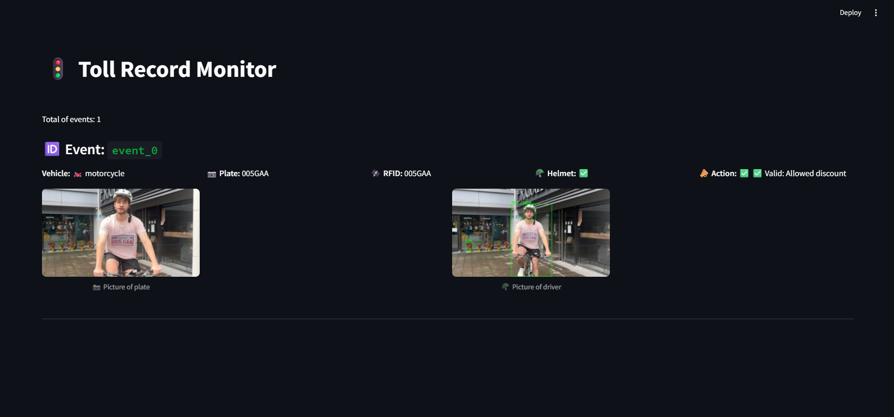
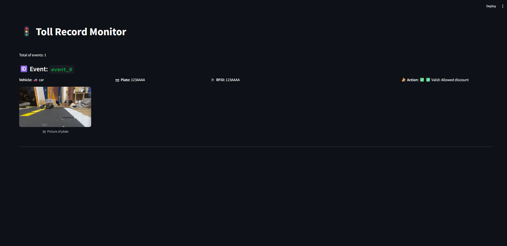

# Toll Record Monitor – AI-Powered Tolling System

This project implements an automated toll monitoring system using computer vision and RFID technology. It identifies vehicles, matches them with their registered RFID tags, verifies safety compliance (e.g. helmet usage for motorcycles), and determines eligibility for toll discounts in real time.

---

##  Features  
✅ License Plate Detection using YOLOv8
✅ Helmet Detection for motorcycles (safety enforcement)
✅ Vehicle Type Recognition (car, motorcycle, etc.)
✅ RFID Match Validation
✅ Real-Time Monitoring Dashboard using FastAPI and Streamlit
✅ Discount Eligibility Rules
✅ Integration with MongoDB 
✅ Exportable logs for auditing

---

##  Dataset for training
The dataset used for training and testing was sourced from **[Roboflow](https://roboflow.com/)**.  

🔗 **Download the dataset to detect the plate here:** [Your Dataset Link](https://universe.roboflow.com/eyantra-twpmn/license-plate-detection-g15hx/dataset/1)  
🔗 **Download the dataset to read the plate here:** [Your Dataset Link](https://universe.roboflow.com/ev-dshfb/license-plate-w8chc)  

###  How to Use the Dataset  
1. **Download** the dataset from Roboflow.  
2. **Extract** the files into the `data/` folder.  

##  System Output Examples
**Motorcycle Example: Valid Discount (Helmet Worn, Plate-RFID Match)**

In this example:
- Vehicle type: Motorcycle 🏍️
- Plate detected: 005GAA
- RFID tag: 005GAA
- Helmet: ✅ Detected
- Action: Valid → Allowed discount ✅

**Car Example: Valid Discount (Plate-RFID Match)**

In this example:
- Vehicle type: Car 🚗
- Plate detected: 123AAAA
- RFID tag: 123AAAA
- Action: Valid → Allowed discount ✅

##  Real Use Case: Paraguay Tolling System
This system is being developed as part of a capstone project to modernize toll collection in Paraguay, where:
- Cars are matched via license plate and RFID
- Motorcycles must wear helmets for safety and to qualify for toll discounts
- Violations are logged with a picture for manual review or fines
